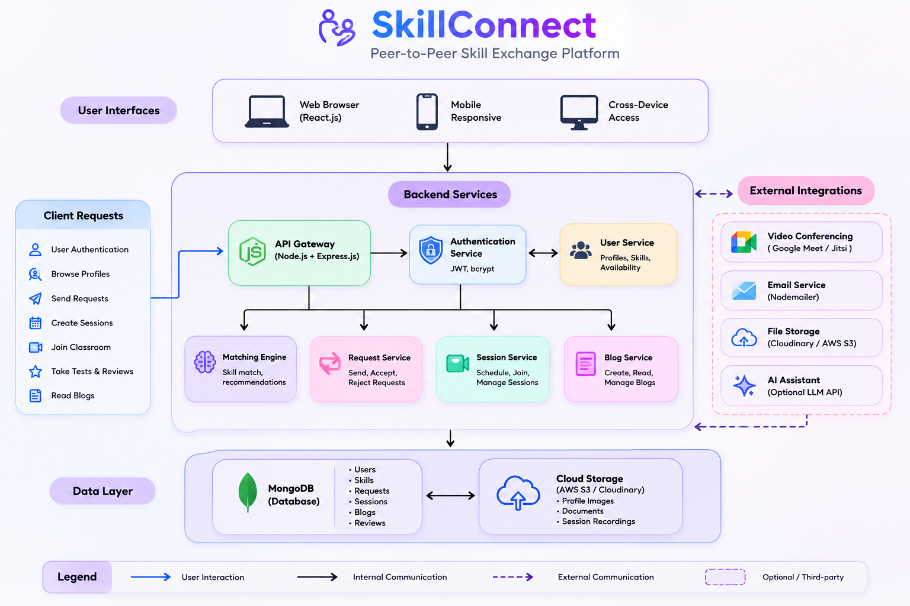

# 🤝 SkillConnect

[](https://github.com/aishwaryabadam/Skill-Connect/blob/main/LICENSE)
[](https://nodejs.org/)
[](https://react.dev/)
[](https://www.mongodb.com/)
[](https://socket.io/)
[](https://webrtc.org/)

A full-stack **peer-to-peer skill exchange platform** where users teach what they know and learn what they need — no money involved, just knowledge for knowledge. Browse profiles, match on complementary skills, request a swap, schedule a session, and meet live in a built-in virtual classroom with video, whiteboard, and chat.

---

## 📋 Table of Contents

- [Features](#-features)
- [Tech Stack](#-tech-stack)
- [Architecture](#-architecture)
- [Installation](#-installation)
- [Usage](#-usage)
- [API Reference](#-api-reference)
- [Real-Time Events](#-real-time-events-socketio)
- [Screenshots](#-screenshots)
- [Contributing](#-contributing)
- [License](#-license)
- [Contact & Support](#-contact--support)

---

## ✨ Features

### 🔎 Browse & Match
- **Skill-Based Discovery** — Find users by the skills they teach and the skills they want to learn
- **Match Scoring** — Requests are ranked by how well two users' skills complement each other
- **Search & Filter** — Quickly narrow down profiles by skill, availability, or category

### 🔁 Exchange & Scheduling
- **Skill Swap Requests** — Send, accept, reject, or reschedule exchange requests
- **Session Management** — Schedule online or offline sessions with full status tracking (pending → scheduled → completed)

### 🎥 Live Virtual Classroom
- **WebRTC Video/Audio Calling** — Real-time face-to-face teaching sessions
- **Shared Whiteboard** — Collaborative drawing surface synced live between both users
- **In-Session Chat** — Text chat alongside the video call

### 📝 Assessment & Feedback
- **Knowledge Tests** — Tutors create MCQ assessments for learners after a session
- **Reviews & Ratings** — Leave feedback after completed sessions to build trust in the community

### 🔔 Community & Engagement
- **Real-Time Notifications** — Instant in-app alerts via Socket.IO for requests, sessions, and messages
- **Blogs** — Community posts for sharing knowledge and tips
- **Rich User Profiles** — Skills, bio, education, availability, and social links

---

## 🛠️ Tech Stack

### **Frontend**
[](https://react.dev/) [](https://vitejs.dev/) [](https://reactrouter.com/) [](https://tailwindcss.com/) [](https://zustand-demo.pmnd.rs/) [](https://axios-http.com/) [](https://socket.io/) [](https://react-hook-form.com/)

### **Backend**
[](https://nodejs.org/) [](https://expressjs.com/) [](https://www.mongodb.com/) [](https://mongoosejs.com/) [](https://socket.io/) [](https://jwt.io/) [](https://www.npmjs.com/package/bcrypt)

### **Real-Time & Communication**
[](https://socket.io/) [](https://webrtc.org/)

---

## 🏗️ Architecture

SkillConnect follows a **client–server architecture** with a React SPA frontend, a REST + WebSocket Express backend, and MongoDB for persistence. Video/audio in the live classroom is peer-to-peer via WebRTC, with Socket.IO used purely for signaling (offer/answer/ICE exchange), whiteboard sync, chat, and notifications.


*(Add your system architecture diagram here — showing Frontend ↔ Backend ↔ Database, plus the Socket.IO signaling and WebRTC peer-to-peer video path)*

**Request flow (typical skill-swap → session lifecycle):**

1. User registers/logs in → JWT issued and stored client-side (Zustand)
2. User browses profiles (`GET /profiles`) and sends a swap request (`POST /requests`)
3. Recipient accepts the request → a `Session` document is created
4. Both users join the classroom room via `join_room` (Socket.IO) at the scheduled time
5. WebRTC handles the live video/audio directly between browsers; Socket.IO relays only signaling data, whiteboard strokes, and chat messages
6. After the session, the tutor can create a test and the learner leaves a review

---

## 🚀 Installation

### Prerequisites

- [Node.js](https://nodejs.org/) v18 or higher
- A [MongoDB Atlas](https://www.mongodb.com/cloud/atlas) cluster (or local MongoDB instance)
- Git

### Quick Start

1. **Clone the Repository**

```bash
git clone https://github.com/aishwaryabadam/Skill-Connect.git
cd Skill-Connect
```

2. **Set Up the Backend**

```bash
cd backend
npm install
cp .env.example .env
```

Fill in `.env`:

```env
PORT=5000
MONGODB_URI=mongodb+srv://<user>:<password>@cluster.mongodb.net/skillconnect
JWT_SECRET=your-strong-secret-key
NODE_ENV=development
CLIENT_ORIGIN=http://localhost:3000
```

> ⚠️ Never commit your `.env` file — it's already listed in `.gitignore`.

```bash
npm run dev     # development, with auto-reload
npm start       # production
```

Backend runs on `http://localhost:5000`.

3. **Set Up the Frontend**

```bash
cd frontend
npm install
npm run dev
```

Frontend runs on `http://localhost:3000`.

### 🪟 Windows Quick Start

Double-click the provided batch scripts in the root folder:

| Script | Purpose |
|---|---|
| `install-backend.bat` | Installs backend dependencies |
| `install-frontend.bat` | Installs frontend dependencies |
| `run-backend.bat` | Starts the backend server |
| `run-frontend.bat` | Starts the frontend dev server |

---

## 📖 Usage

### 🔎 Finding a Skill Match
1. Sign up and complete your profile with skills you can **teach** and skills you want to **learn**
2. Browse or search other profiles filtered by skill
3. Send a skill swap request to a matching user

### 🔁 Managing Requests & Sessions
1. Accept, reject, or reschedule incoming requests from the **Requests** page
2. Once accepted, schedule a session (online or offline)
3. Track session status from **Sessions** → **Session Detail**

### 🎥 Live Classroom
1. Join the classroom at the scheduled time
2. Use video/audio (WebRTC), the shared whiteboard, and chat together
3. After the session, the tutor can issue a short MCQ test to check understanding

### ⭐ After the Session
1. Leave a review and rating for the other user
2. Read or write community **Blog** posts to share what you've learned

---

## 📡 API Reference

All endpoints are prefixed with `/api`.

| Method | Endpoint | Auth | Description |
|---|---|---|---|
| `POST` | `/auth/register` | No | Register a new user |
| `POST` | `/auth/login` | No | Login and receive JWT |
| `GET` | `/profiles` | No | Browse & search profiles |
| `GET` | `/profiles/:userId` | No | View a user's profile |
| `PUT` | `/profiles` | Yes | Update own profile |
| `POST` | `/requests` | Yes | Send a skill swap request |
| `GET` | `/requests` | Yes | Get incoming & outgoing requests |
| `PATCH` | `/requests/:id` | Yes | Accept / reject / reschedule |
| `POST` | `/sessions` | Yes | Create a session from accepted request |
| `GET` | `/sessions` | Yes | List user's sessions |
| `GET` | `/sessions/:id` | Yes | Get session details |
| `PATCH` | `/sessions/:id/status` | Yes | Update session status |
| `POST` | `/tests` | Yes | Create a test for a session |
| `POST` | `/tests/:id/attempt` | Yes | Submit test answers |
| `POST` | `/reviews` | Yes | Submit a session review |
| `GET` | `/notifications` | Yes | Fetch notifications |
| `PATCH` | `/notifications/:id/read` | Yes | Mark notification as read |
| `GET` | `/blogs` | No | List blog posts |
| `POST` | `/blogs` | Yes | Create a blog post |
| `GET` | `/health` | No | Server health check |

---

## ⚡ Real-Time Events (Socket.IO)

Authentication is required via a JWT token passed in the socket handshake.

| Event | Direction | Description |
|---|---|---|
| `join_notifications` | Client → Server | Subscribe to personal notification room |
| `join_room` | Client → Server | Join a classroom session room |
| `leave_room` | Client → Server | Leave a classroom session room |
| `chat_message` | Bidirectional | Send/receive in-session chat messages |
| `whiteboard_draw` | Bidirectional | Broadcast whiteboard strokes |
| `whiteboard_clear` | Bidirectional | Clear the shared whiteboard |
| `webrtc_offer` | Bidirectional | WebRTC connection offer |
| `webrtc_answer` | Bidirectional | WebRTC connection answer |
| `webrtc_ice` | Bidirectional | ICE candidate exchange |

---

## 📸 Screenshots

### 🏠 Home Page


*Landing page introducing SkillConnect and its core skill exchange platform.*


.
---


## 🤝 Contributing

1. Fork the repository
2. Create a feature branch: `git checkout -b feature/your-feature`
3. Commit your changes: `git commit -m "feat: add your feature"`
4. Push to the branch: `git push origin feature/your-feature`
5. Open a Pull Request

### Areas for Contribution
- 🎨 UI/UX improvements
- 🧪 Additional test coverage
- 📱 Mobile responsiveness enhancements
- 🌐 Localization / multi-language support
- 🔒 Security hardening (rate limiting, input sanitization)

---

## 📄 License

This project is licensed under the [MIT License](https://github.com/aishwaryabadam/Skill-Connect/blob/main/LICENSE).

---

## 📞 Contact & Support

- 🐙 **GitHub**: [aishwaryabadam](https://github.com/aishwaryabadam)
- 📧 **Email**: *add your contact email here*
- 💼 **LinkedIn**: *add your LinkedIn profile link here*

---

**Built with ❤️ to make peer-to-peer learning simple and accessible**
